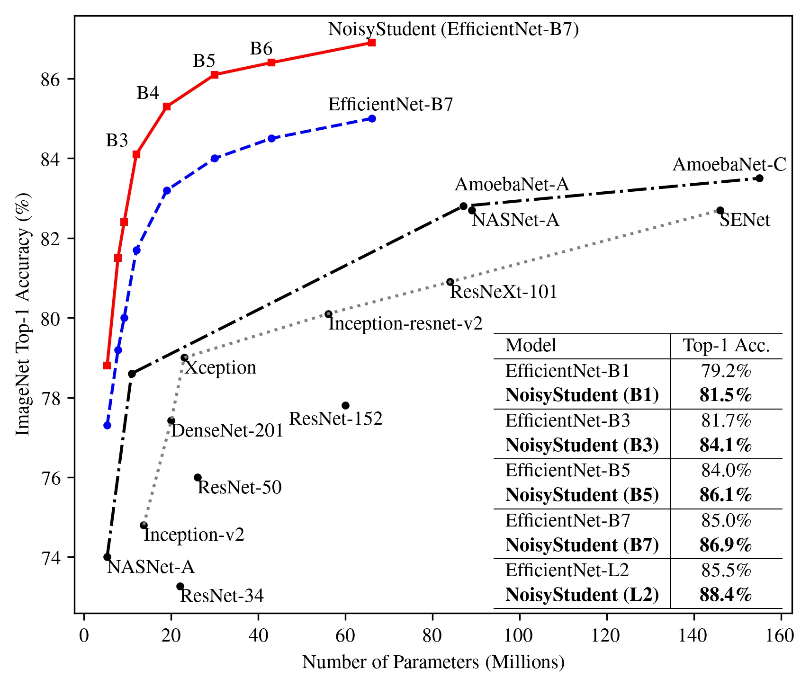

# NoisyStudent

## Overview

NoisyStudent is a semi-supervised learning method which achieves 88.4% top-1
accuracy on ImageNet (SOTA). NoisyStudent is based on the self-training
framework with noise injected to the student model.

We are releasing the training code runnable on SVHN. For ImageNet, we are
experimenting with public image datasets as unlabeled data and will release the
training code soon.

For a detailed description of technical details and experimental results, please
refer to our paper:

[Self-training with Noisy Student improves ImageNet classification.](https://arxiv.org/abs/1911.04252)

Qizhe Xie, Minh-Thang Luong, Eduard Hovy and Quoc V. Le.

## Release Notes

*   Feb 16, 2020: Code on SVHN.

## SVHN Experiments

```shell
# Download and preprocess SVHN
python proc_svhn.py \
  --task_name=svhn \
  --raw_data_dir=data/svhn/raw \
  --output_dir=data/svhn/proc

# Download the teacher model trained on labeled data with accuracy 97.9.
mkdir ckpt
wget https://storage.googleapis.com/noisystudent/ckpts/svhn/teacher_ckpt.tar.gz -O ckpt/teacher_ckpt.tar.gz
cd ckpt && tar xzvf teacher_ckpt.tar.gz && cd ..

# Training
python main.py \
    --model_name=efficientnet-b0 \
    --use_tpu=False \
    --use_bfloat16=False \
    --task_name=svhn \
    --mode=train \
    --train_batch_size=128 \
    --iterations_per_loop=1000 \
    --save_checkpoints_steps=1000 \
    --unlabel_ratio=5 \
    --teacher_softmax_temp=1 \
    --augment_name=v1 \
    --randaug_mag=5 \
    --final_base_lr=0.0002 \
    --label_data_dir=./data/svhn/proc \
    --teacher_model_name=efficientnet-b0 \
    --teacher_model_path=ckpt/teacher_ckpt/model.ckpt \
    --model_dir=./ckpt/exp_1 \
    --unlabel_data_dir=./data/svhn/proc/unlabeled

# Eval (expected accuracy: 98.6 +- 0.1)
python main.py \
    --model_name=efficientnet-b0 \
    --use_tpu=False \
    --use_bfloat16=False \
    --task_name=svhn \
    --mode=eval \
    --label_data_dir=./data/svhn/proc \
    --model_dir=./ckpt/exp_1
```

You can also use the colab script [noisy_student_svhn.ipynb](https://github.com/google-research/noisystudent/blob/master/noisy_student_svhn.ipynb) to try the method on free Colab GPUs. 

## ImageNet Results

NoisyStudent leads to significant improvements across model sizes.
<p align="center">  </p>

## Models Trained on ImageNet

Here are models trained on ImageNet with JFT-300M unlabeled data:
|   | B0 | B1 | B2 | B3 | B4 | B5 | B6 | B7 | L2-475 | L2 
| - | -- | -- | -- | -- | -- | -- | -- | -- | --     | -- 
NoisyStudent + RA |78.8% ([ckpt](https://storage.googleapis.com/cloud-tpu-checkpoints/efficientnet/noisystudent/noisy_student_efficientnet-b0.tar.gz)) | 81.5% ([ckpt](https://storage.googleapis.com/cloud-tpu-checkpoints/efficientnet/noisystudent/noisy_student_efficientnet-b1.tar.gz)) | 82.4% ([ckpt](https://storage.googleapis.com/cloud-tpu-checkpoints/efficientnet/noisystudent/noisy_student_efficientnet-b2.tar.gz)) | 84.1% ([ckpt](https://storage.googleapis.com/cloud-tpu-checkpoints/efficientnet/noisystudent/noisy_student_efficientnet-b3.tar.gz)) | 85.3% ([ckpt](https://storage.googleapis.com/cloud-tpu-checkpoints/efficientnet/noisystudent/noisy_student_efficientnet-b4.tar.gz)) | 86.1% ([ckpt](https://storage.googleapis.com/cloud-tpu-checkpoints/efficientnet/noisystudent/noisy_student_efficientnet-b5.tar.gz)) | 86.4% ([ckpt](https://storage.googleapis.com/cloud-tpu-checkpoints/efficientnet/noisystudent/noisy_student_efficientnet-b6.tar.gz)) | 86.9% ([ckpt](https://storage.googleapis.com/cloud-tpu-checkpoints/efficientnet/noisystudent/noisy_student_efficientnet-b7.tar.gz)) | 88.2%([ckpt](https://storage.googleapis.com/cloud-tpu-checkpoints/efficientnet/noisystudent/noisy_student_efficientnet-l2_475.tar.gz)) | 88.4% ([ckpt](https://storage.googleapis.com/cloud-tpu-checkpoints/efficientnet/noisystudent/noisy_student_efficientnet-l2.tar.gz))

<sup>* L2-475 means the same L2 architecture with input image size 475 (Please set "--input_image_size=475" for using this checkpoint). </sup>


## Relevant Papers 

NoisyStudent
```
@article{xie2019self,
  title={Self-training with Noisy Student improves ImageNet classification},
  author={Xie, Qizhe and Hovy, Eduard and Luong, Minh-Thang and Le, Quoc V},
  journal={arXiv preprint arXiv:1911.04252},
  year={2019}
}
```

EfficientNet : Our backbone model 
```
@article{tan2019efficientnet,
  title={Efficientnet: Rethinking model scaling for convolutional neural networks},
  author={Tan, Mingxing and Le, Quoc V},
  journal={arXiv preprint arXiv:1905.11946},
  year={2019}
}
```

RandAugment: An effective data augmentation noise 
```
@article{cubuk2019randaugment,
  title={RandAugment: Practical data augmentation with no separate search},
  author={Cubuk, Ekin D and Zoph, Barret and Shlens, Jonathon and Le, Quoc V},
  journal={arXiv preprint arXiv:1909.13719},
  year={2019}
}
```

## Disclaimer

This is not an officially supported Google product.
